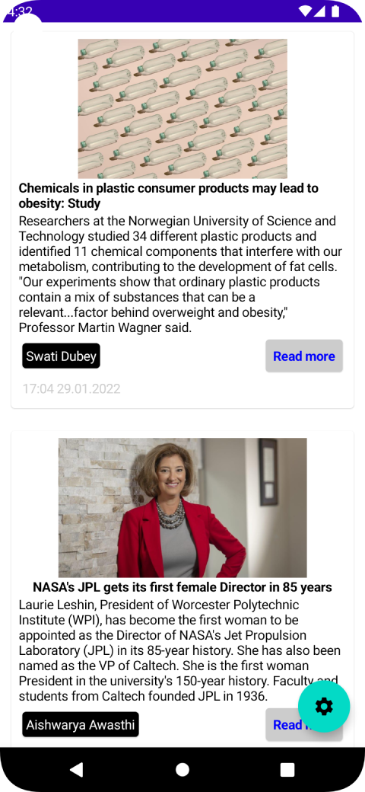
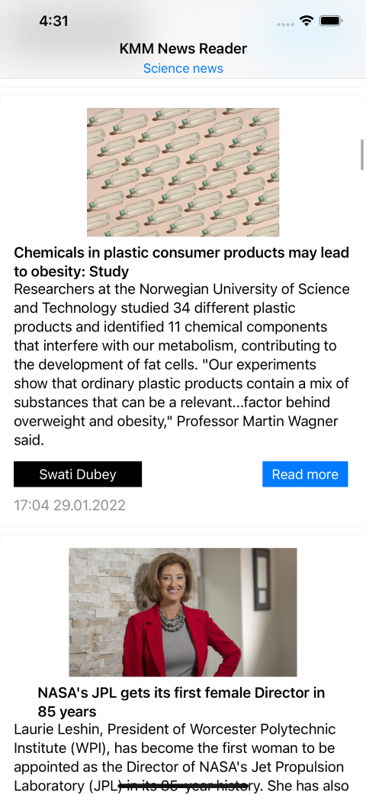

# KMM News API reader
## Multiplatform(iOS/Android) news reader with offline cache example

Kotlin Multiplatform Mobile News API reader with offline cache support.
Feel free to criticize and improve project via github.

##Screenshots

## Features
- Fetch news from https://inshortsapi.vercel.app/ by Ktor
- Save fetched news to local SQLDelight database

## Stack
- [KMM] - for code sharing (iOS/Android)
- [Ktor] (with Json and Logging features) - to networking
- [SQLDelight] - to offline data caching via SQLite local database
- [Koin] - for DI
- [Napier] - for logging
- [SwiftUI/Jetpack compose] - platforms UI
- [MVVM arch]
- [Kotlin/Native Flow]

## TODO List
- Add tests on all layers
- Add Pagination (Multiplatform?)
- Check network state when cache is empty
- Add SQLCipher to encrypt local database (only for fun:) )
- Dark theme, beautiful design and etc...

## Tech
    git clone
    import to Android studio(Bumblebee or newer)
    gradle sync/build to run on Android device
    
    cd iosApp then 'pod install' ('arch -x86_64 pod install' on Apple Silicon devices)
    import to XCode (latest)
    build/run to run on iOS device
## License
**Absolutely Free and Opened!**
